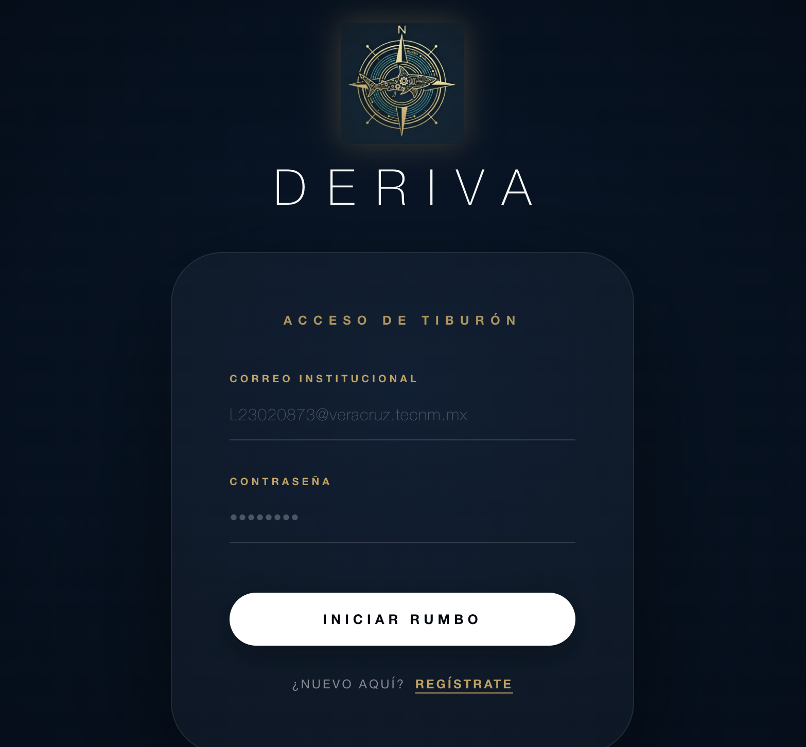
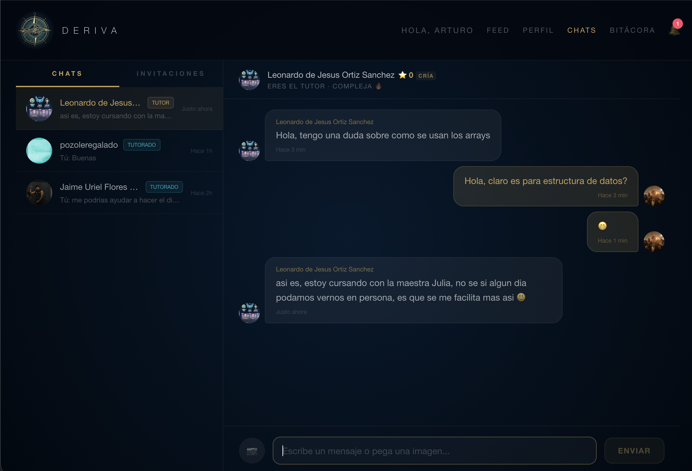

# 🦈 DERIVA

> **El océano de conocimiento para la manada del ITVer.**
> Una plataforma colaborativa diseñada para conectar estudiantes, facilitar asesorías académicas y fomentar el apoyo mutuo mediante un sistema de gamificación.

[visita Deriva aqui](https://deriva.velantex.dev)

---

## 📸 Vistazo a la Plataforma

| Login Institucional | Tablero de Solicitudes (Feed) |
| :---: | :---: |
| `    | `   |

| Chat en Tiempo Real | Perfil y Reputación |
| :---: | :---: |
| `    | `    |

---

## 🌊 ¿Qué es Deriva?

Deriva nace de la necesidad de centralizar el apoyo académico dentro del Instituto Tecnológico de Veracruz.Permite a los estudiantes publicar dudas específicas de sus materias y conectar con compañeros que tienen el conocimiento para ayudarlos, todo bajo un ecosistema seguro y exclusivo para la institución.

### ✨ Características Principales

* **🔒 Acceso Exclusivo:** Validación de identidad mediante correo con dominio institucional para garantizar la seguridad de la comunidad.
* **🤝 Match Académico:** Sistema de publicación de solicitudes de ayuda y ofertas de tutoría, con filtros por materia y semestre.
* **💬 Comunicación Inmediata:** Chat integrado en tiempo real mediante WebSockets para coordinar las asesorías de forma privada.
* **🏆 Sistema de Reputación:** Los usuarios ganan **Créditos Tiburón** al completar tutorías exitosamente, promoviendo la participación activa.
* **🧠 Asistencia con Inteligencia Artificial:** Recomendación automática de tutores basada en el contenido de las solicitudes y clasificación inteligente de publicaciones.

---

## 🛠️ Stack Tecnológico

El proyecto está construido bajo una arquitectura cliente-servidor escalable:

**Frontend (Web)**
* **Framework:** Next.js (App Router) / React
* **Estilos:** Tailwind CSS (Diseño oscuro, *Glassmorphism*)
* **Hosting:** Vercel

**Backend & API**
* **Entorno:** Node.js
* **Tiempo Real:** Socket.io (WebSockets)
* **Hosting:** Railway

**Base de Datos & Almacenamiento**
* **Proveedor:** Supabase (PostgreSQL)

---

## 👥 El Equipo (Scrum)

Este proyecto fue desarrollado para la asignatura de Ingeniería de Software aplicando la metodología ágil Scrum:

* **Arturo Báez:** Product Owner / Lead Backend Developer, Lead Frontend Developer, Database Administrator
* **Uriel Flores:** Scrum Master / Database Developer [GitHub Profile](https://github.com/UrielCabrera05)
* **Leonardo Ortiz:** Frontend Developer

---